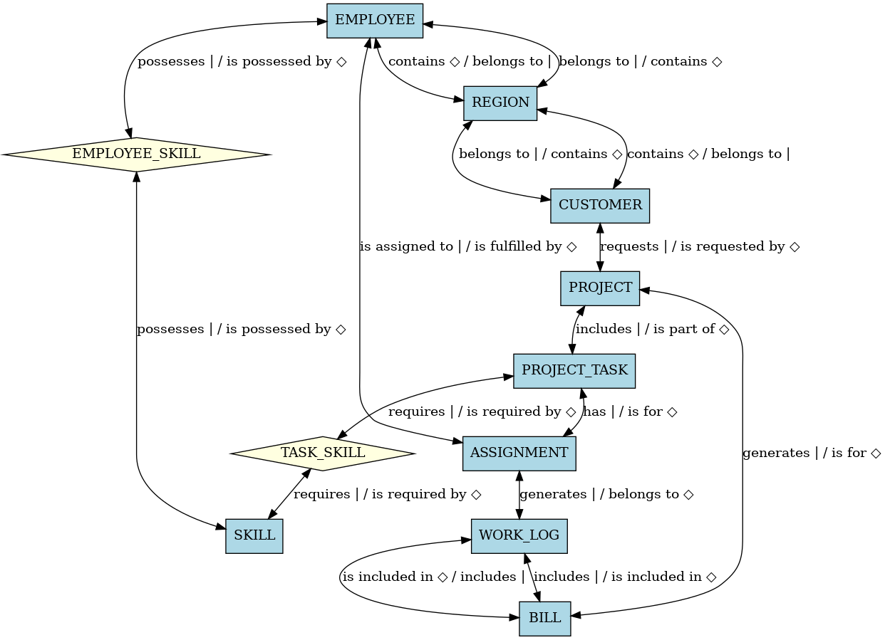
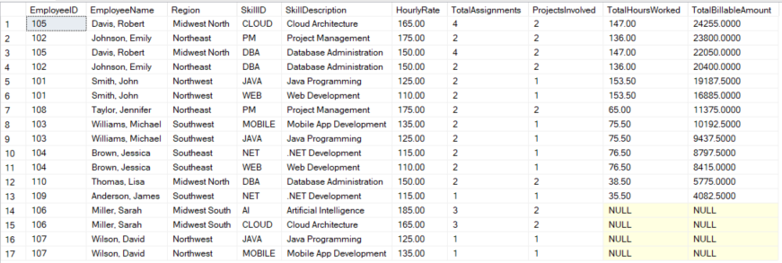
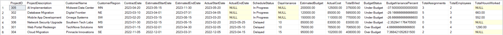
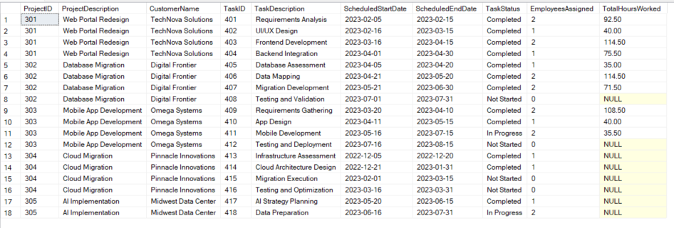
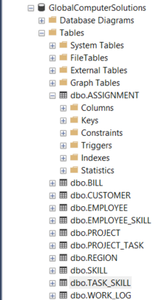

# Global Computer Solutions (GCS) Database Project

A comprehensive database management system for tracking employees, projects, skills, and billing for a consulting company.

## 📋 Project Overview

This project implements a fully normalized relational database for Global Computer Solutions, a company that manages consulting projects across multiple regions. The database tracks employee skills, project assignments, task management, and billing information.

## 🗄️ Database Schema

The database consists of 11 interconnected tables designed in Third Normal Form (3NF):

### Core Entities
- **REGION**: Geographic regions where the company operates
- **CUSTOMER**: Client information and regional assignments
- **EMPLOYEE**: Staff member details and hire information
- **SKILL**: Available skills with hourly billing rates
- **PROJECT**: Project details, budgets, and timelines

### Operational Tables
- **PROJECT_TASK**: Individual tasks within projects
- **ASSIGNMENT**: Employee-to-task assignments
- **WORK_LOG**: Time tracking for billable hours
- **BILL**: Billing records for projects

### Junction Tables
- **EMPLOYEE_SKILL**: Many-to-many relationship between employees and their skills
- **TASK_SKILL**: Skills required for specific tasks



## 🚀 Getting Started

### Prerequisites
- Microsoft SQL Server (2016 or later)
- SQL Server Management Studio (SSMS)

### Installation

1. **Clone the repository**
   ```bash
   git clone https://github.com/yourusername/gcs-database-project.git
   cd gcs-database-project
   ```

2. **Create the database**
   - Open SQL Server Management Studio
   - Connect to your SQL Server instance
   - Create a new database named `GCS_Database`

3. **Run the schema script**
   ```sql
   -- Execute the complete database schema
   USE GCS_Database;
   GO
   -- Run database_schema.sql
   ```

## 📊 Available Reports

The project includes three comprehensive business intelligence reports:

### 1. Employee Skills Utilization Report
**File**: `reports/employee_skills_report.sql`

Tracks how effectively employee skills are being utilized across projects, including:
- Employee skill inventory
- Hours worked per skill
- Total billable amounts
- Project involvement metrics



### 2. Project Financial Summary Report
**File**: `reports/project_financial_report.sql`

Provides financial oversight with budget tracking:
- Budget vs. actual cost analysis
- Schedule performance metrics
- Billing status and variance calculations
- Resource allocation summary



### 3. Project Progress Report
**File**: `reports/project_progress_report.sql`

Monitors project execution and task completion:
- Task status tracking (Not Started, In Progress, Completed)
- Employee assignment counts
- Hours worked per task
- Schedule adherence



## 🏗️ Database Structure



### Key Features
- **Referential Integrity**: All foreign key relationships properly enforced
- **Data Validation**: Check constraints ensure data quality
- **Scalability**: Normalized design supports business growth
- **Performance**: Optimized for common query patterns

### Naming Conventions
- Table names: UPPERCASE
- Column names: Follow pattern `[type]_[name]_[table_abbreviation]`
  - `c_` = Code/ID fields
  - `t_` = Text fields
  - `d_` = Date fields
  - `n_` = Numeric fields
  - `i_` = Integer fields

## 💼 Business Use Cases

1. **Resource Management**: Track employee skills and availability
2. **Project Planning**: Assign appropriate skills to project tasks
3. **Financial Control**: Monitor budgets and billing accuracy
4. **Performance Analysis**: Evaluate project success and employee productivity
5. **Capacity Planning**: Understand skill gaps and training needs

## 🔧 Development Notes

### Database Design Principles
- Third Normal Form (3NF) compliance
- Elimination of redundancy
- Consistent data types and naming
- Comprehensive constraint implementation

### Performance Considerations
- Indexed primary and foreign keys
- Optimized join patterns in reports
- Efficient aggregation queries

## 📈 Future Enhancements

- **Data Warehouse**: Implement dimensional modeling for analytics
- **API Layer**: REST API for application integration
- **Reporting Dashboard**: Business intelligence visualization
- **Audit Trail**: Change tracking and compliance features
- **Mobile Access**: Timesheet entry mobile application

## 🤝 Contributing

1. Fork the repository
2. Create a feature branch (`git checkout -b feature/AmazingFeature`)
3. Commit your changes (`git commit -m 'Add some AmazingFeature'`)
4. Push to the branch (`git push origin feature/AmazingFeature`)
5. Open a Pull Request

## 📄 License

This project is created for educational purposes as part of ACIS 5504 coursework.

## 📧 Contact

For questions about this database design or implementation, please reach out through the repository issues.

---

**Note**: This database contains sample data for demonstration purposes. Ensure proper security measures and data protection practices in production environments.
